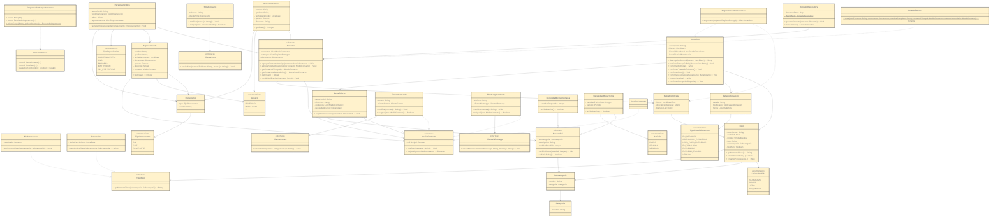

# DonaTrack

## Diagrama de clases

```mermaid
%%{init: {
  'theme': 'base',
  'themeVariables': {
    'primaryColor': '#FFF2CC',
    'primaryTextColor': '#000000',
    'primaryBorderColor': '#555555',
    'lineColor': '#888888',
    'textColor': '#888888'
  }
}}%%
classDiagram
    %%=============Entidades==================
    %%=============ordenando por package======
    
    %%beneficiario
    class Beneficiario {
        - razonSocial: String
        - direccion: String
        - contactos: List~MedioContacto~
        - necesidades: List~Necesidad~

        + registrarNecesidad(necesidad: Necesidad): void
    }

    %%bien
    class NoPerecedero {
        - estaUsado: Boolean
        
        + getNombreClave(subcategoria: Subcategoria): String
    }
    class Perecedero {
        - fechaVencimiento: LocalDate
        
        + getNombreClave(subcategoria: Subcategoria): String
    }
    class TipoBien {
        <<interface>>
        + getNombreClave(subcategoria: Subcategoria): String
    }
    class Bien {
        - descripcion: String
        - cantidad: float
        - unidad: UnidadMedida
        - foto: String
        - subcategoria: Subcategoria
        - tipoBien: TipoBien

        + getNombreClave(): String
        + crearPerecedero(...): Bien
        + crearNoPerecedero(...): Bien
    }
    class Categoria {
        - nombre: String
    }
    class Subcategoria {
        - nombre: String
        - categoria: Categoria
    }
    class UnidadMedida {
        <<enumeration>>
        KILOGRAMO
        GRAMO
        LITRO
        SIN_UNIDAD
    }
    
    %%cargabatch
    class DonanteParser {
        + record DatosDonante(...)
        + record Resultado(...)

        + parseCsv(csvContent: Iterable<String[]>): Iterable<Resultado>
    }
    class OrquestadorCargaDonantes {
        + record Error(Int)
        + record ResultadoImportacion(...)
        
        + iniciarCarga(String pathArchivoCsv): ResultadoImportacion$
    }
    
    %%donacion
    class Donacion {
        - descripcion: String
        - bienes: List~Bien~
        - historialEstados: List~EstadoDonacion~
        - beneficiario: Beneficiario

        + descripcionGeneral(bienes: List~Bien~): String
        + notificarEntregaFallida(observacion: String): Void
        + confirmarEntrega(): Void
        + confirmarTrasladoEnCurso(): Void
        + confirmarRuta(): Void
        + confirmarAsignacion(beneficiario: Beneficiario): Void
        + marcarVencida(): Void
        + confirmarRecepcionDeposito(): Void
    }
    class EstadoDonacion {
        - detalle: String
        - tipoEstado: TipoEstadoDonacion
        - fecha: LocalDateTime
    }
    class TipoEstadoDonacion {
        <<enumeration>>
        EN_DEPOSITO
        ASIGNACION_REALIZADA
        LISTA_PARA_ENTREGAR
        EN_TRASLADO
        ENTREGADA
        ENTREGA_FALLIDA
        VENCIDA
    }
    
    %%donante
    class Documento {
        - tipo: TipoDocumento
        - detalle: String
    }
    class Donante {
        <<abstract>>
        - contactos: List~MedioContacto~
        - entregas: List~RegistroEntrega~
        - documento: Documento

        + agregarContactoPrincipal(contacto: MedioContacto): Void
        + agregarContactoSecundario(contacto: MedioContacto): Void
        + getContactoPrincipal(): MedioContacto
        + getContactosSecundarios(): List~MedioContacto~
        + getEmail(): String
        + recibirNotificacion(mensaje: String): Void
    }
    class DonanteFactory {
        + crear(tipoPersona: String, documento: Documento, nombreCompleto: String, contactoPrincipal: MedioContacto, contactoSecundario: MedioContacto): Donante$
    }
    class Genero {
        <<enumeration>>
        FEMENINO
        MASCULINO
        X
    }
    class PersonaHumana {
        - nombre: String
        - apellido: String
        - fechaNacimiento: LocalDate
        - genero: Genero
        - direccion: String
        
        + getEdad(): Integer
    }
    class PersonaJuridica {
        - razonSocial: String
        - tipoOrganizacion: TipoOrganizacion
        - rubro: String
        - representantes: List~Representante~

        + agregarRepresentante(representante: Representante): Void
    }
    class RegistroEntrega {
        - fecha: LocalDateTime
        - descripcionGeneral: String
        - bienes: List~Bien~
    }
    class Representante {
        - nombre: String
        - apellido: String
        - fechaNacimiento: LocalDate
        - documento: Documento
        - genero: Genero
        - direccion: String
        - contacto: MedioContacto

        + getEdad(): Integer
    }
    class TipoDocumento {
        <<enumeration>>
        DNI
        CUIT
        PASAPORTE
    }
    class TipoOrganizacion {
        <<enumeration>>
        GUBERNAMENTAL
        ONG
        EMPRESA
        INSTITUCION
        SIN_ESPECIFICAR
    }
    
    %%medioContacto
    class ClienteCorreo {
        <<interface>>
        + enviarCorreo(correo: String, mensaje: String): Void
    }
    class ClienteSms {
        <<interface>>
        + enviarSms(numeroTelefono: String, mensaje: String): Void
    }
    class ClienteWhatsapp {
        <<interface>>
        + enviarMensaje(numeroWhatsapp: String, mensaje: String): Void
    }
    class CorreoContacto {
        - correo: String
        - clienteCorreo: ClienteCorreo

        + notificar(mensaje: String): Void
        + esIgual(otro: MedioContacto): Boolean
    }
    class MedioContacto {
        <<abstract>>
        - esPrincipal: Boolean

        + notificar(message: String): Void*
        + esIgualA(otro: MedioContacto): Boolean*
    }
    class SmsContacto {
        - telefono: String
        - clienteSms: ClienteSms

        + notificar(mensaje: String): Void
        + esIgual(otro: MedioContacto): Boolean
    }
    class WhatsappContacto {
        - telefono: String
        - clienteWhatsapp: ClienteWhatsapp

        + notificar(mensaje: String): Void
        + esIgual(otro: MedioContacto): Boolean
    }
    
    %%necesidades
    class Necesidad {
        <<abstract>>
        - subcategoria: Subcategoria
        - descripcion: String
        - cantidadRecibida: Integer

        + recibirBienes(cantidad: Integer): Void
        + esSatisfecha(): Boolean
    }
    class NecesidadExtraordinaria {
        - cantidadRequerida: Integer

        + esSatisfecha(): Boolean
    }
    class NecesidadRecurrente {
        - cantidadPorPeriodo: Integer
        - periodo: Periodo

        + esSatisfecha(): Boolean
    }
    class Periodo {
        <<enumeration>>
        DIARIO
        SEMANAL
        MENSUAL
    }
    
    %%segmentador
    class SegmentadorDonaciones {
        + segmentar(registro: RegistroEntrega): List~Donacion~
    }

    %%peristencia
    class DonanteRepository {
        - donantesStore: Map<String, Donante>
        - INSTANCE: DonanteRepository$
        
        + guardarDonante(donante: Donante): Void
        + buscarTodos(): List~Donante~
    }
    
    %%==============Relaciones===============
    %%==============Ordenado por package=====
    
    %%beneficiario
    Beneficiario -->"*" MedioContacto
    Beneficiario -->"*" Necesidad
    
    %%bien
    NoPerecedero ..|> TipoBien
    Perecedero ..|> TipoBien
    Bien --> UnidadMedida
    Bien --> Subcategoria
    Bien --> TipoBien
    Subcategoria --> Categoria

    %%cargabatch
    OrquestadorCargaDonantes ..> DonanteParser

    %%donacion
    Donacion -->"*" Bien
    Donacion -->"*" EstadoDonacion
    Donacion --> Beneficiario
    EstadoDonacion --> TipoEstadoDonacion

    %%donante
    PersonaHumana --|> Donante
    PersonaJuridica --|> Donante
    Donante -->"*" MedioContacto
    Donante -->"*" RegistroEntrega
    PersonaJuridica -->"*" Representante
    RegistroEntrega -->"*" Bien
    Documento --> TipoDocumento    
    PersonaHumana --> Genero
    PersonaHumana --> Documento
    PersonaJuridica --> TipoOrganizacion
    PersonaJuridica --> Documento
    Representante --> Documento
    Representante --> Genero
    Representante --> MedioContacto
    DonanteFactory ..> Donante

    %%medioContacto
    CorreoContacto ..|> MedioContacto
    SmsDeContacto ..|> MedioContacto
    WhatsappContacto ..|> MedioContacto
    CorreoContacto --> ClienteCorreo
    SmsContacto --> ClienteSms
    WhatsappContacto --> ClienteWhatsapp
    
    %%necesidades
    NecesidadExtraordinaria --|> Necesidad
    NecesidadRecurrente --|> Necesidad
    Necesidad --> Subcategoria
    NecesidadRecurrente --> Periodo
    
    %%segmentador
    SegmentadorDonaciones ..> RegistroEntrega
    SegmentadorDonaciones ..> Donacion
    
    %%peristencia
    DonanteRepository -->"*" Donante
```
