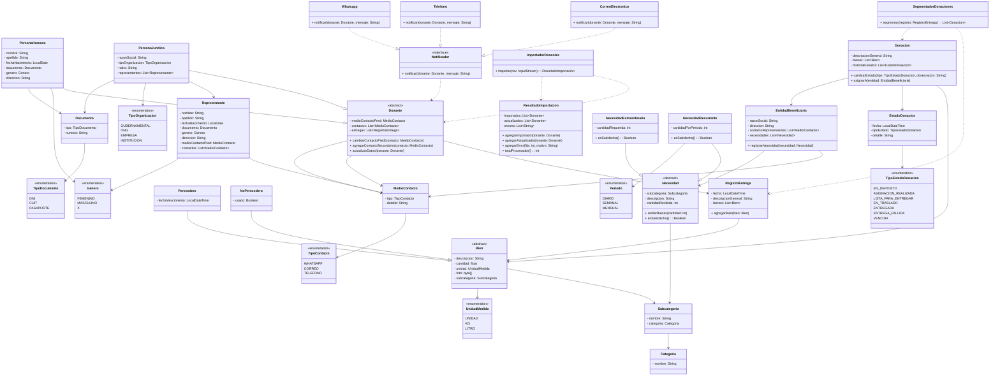

# DonaTrack

## Diagrama de clases

```mermaid
classDiagram

    class Donante {
        <<abstract>>
        - medioContactoPred: MedioContacto
        - contactos: List~MedioContacto~
        - entregas: List~RegistroEntrega~
        + cambiarContactoPred(contacto: MedioContacto)
        + agregarContactoSecundario(contacto: MedioContacto)
        + actualizarDatos(donante: Donante)
    }

    class PersonaHumana {
        - nombre: String
        - apellido: String
        - fechaNacimiento: LocalDate
        - documento: Documento
        - genero: Genero
        - direccion: String
    }

    class PersonaJuridica {
        - razonSocial: String
        - tipoOrganizacion: TipoOrganizacion
        - rubro: String
        - representantes: List~Representante~
    }

    class Representante {
        - nombre: String
        - apellido: String
        - fechaNacimiento: LocalDate
        - documento: Documento
        - genero: Genero
        - direccion: String
        - medioContactoPred: MedioContacto
        - contactos: List~MedioContacto~
    }

    class Documento {
        - tipo: TipoDocumento
        - numero: String
    }
    
    class MedioContacto {
        - tipo: TipoContacto
        - detalle: String
    }

    class RegistroEntrega {
        - fecha: LocalDateTime
        - descripcionGeneral: String
        - bienes: List~Bien~
        + agregarBien(bien: Bien)
    }

    class Donacion {
        - descripcionGeneral: String
        - bienes: List~Bien~
        - historialEstados: List~EstadoDonacion~
        + cambiarEstado(tipo: TipoEstadoDonacion, observacion: String)
        + asignarA(entidad: EntidadBeneficiaria)
    }

    class EstadoDonacion {
        - fecha: LocalDateTime
        - tipoEstado: TipoEstadoDonacion
        - detalle: String
    }

    class Bien {
        <<abstract>>
        - descripcion: String
        - cantidad: float
        - unidad: UnidadMedida
        - foto: byte[]
        - subcategoria: Subcategoria
    }

    class Perecedero {
        - fechaVencimiento: LocalDateTime
    }

    class NoPerecedero {
        - usado: Boolean
    }

    class Categoria {
        - nombre: String
    }

    class Subcategoria {
        - nombre: String
        - categoria: Categoria
    }

    class SegmentadorDonaciones {
        + segmentar(registro: RegistroEntrega): List~Donacion~
    }

    class ImportadorDonantes {
        + importar(csv: InputStream): ResultadoImportacion
    }

    class ResultadoImportacion {
        - importados: List~Donante~
        - actualizados: List~Donante~
        - errores: List~String~
        + agregarImportado(donante: Donante)
        + agregarActualizado(donante: Donante)
        + agregarError(fila: int, motivo: String)
        + totalProcesados(): int
    }

    class EntidadBeneficiaria {
        - razonSocial: String
        - direccion: String
        - contactoRepresentantes: List~MedioContacto~
        - necesidades: List~Necesidad~
        + registrarNecesidad(necesidad: Necesidad)
    }

    class Necesidad {
        <<abstract>>
        - subcategoria: Subcategoria
        - descripcion: String
        - cantidadRecibida: int
        + recibirBienes(cantidad: int)
        + esSatisfecha(): Boolean
    }

    class NecesidadExtraordinaria {
        - cantidadRequerida: int
        + esSatisfecha(): Boolean
    }

    class NecesidadRecurrente {
        - cantidadPorPeriodo: int
        + esSatisfecha(): Boolean
    }

    class Notificador {
        <<interface>>
        + notificar(donante: Donante, mensaje: String)
    }

    class CorreoElectronico {
        + notificar(donante: Donante, mensaje: String)
    }

    class Telefono {
        + notificar(donante: Donante, mensaje: String)
    }

    class Whatsapp {
        + notificar(donante: Donante, mensaje: String)
    }

    class Genero {
        <<enumeration>>
        FEMENINO
        MASCULINO
        X
    }

    class TipoOrganizacion {
        <<enumeration>>
        GUBERNAMENTAL
        ONG
        EMPRESA
        INSTITUCION
    }

    class TipoContacto {
        <<enumeration>>
        WHATSAPP
        CORREO
        TELEFONO
    }

    class TipoDocumento {
        <<enumeration>>
        DNI
        CUIT
        PASAPORTE
    }

    class TipoEstadoDonacion {
        <<enumeration>>
        EN_DEPOSITO
        ASIGNACION_REALIZADA
        LISTA_PARA_ENTREGAR
        EN_TRASLADO
        ENTREGADA
        ENTREGA_FALLIDA
        VENCIDA
    }

    class UnidadMedida {
        <<enumeration>>
        UNIDAD
        KG
        LITRO
    }

    class Periodo {
        <<enumeration>>
        DIARIO
        SEMANAL
        MENSUAL
    }

    PersonaHumana --|> Donante
    PersonaJuridica --|> Donante
    Perecedero --|> Bien
    NoPerecedero --|> Bien
    NecesidadExtraordinaria --|> Necesidad
    NecesidadRecurrente --|> Necesidad
    CorreoElectronico ..|> Notificador
    Telefono ..|> Notificador
    Whatsapp ..|> Notificador

    Donante --> RegistroEntrega
    Donante --> MedioContacto
    Donante --> MedioContacto
    PersonaJuridica --> Representante
    Representante --> MedioContacto
    PersonaHumana --> Genero
    Representante --> Genero
    PersonaJuridica --> TipoOrganizacion
    PersonaHumana --> Documento
    PersonaJuridica --> Documento
    Documento --> TipoDocumento

    RegistroEntrega --> Bien
    Donacion --> Bien
    Donacion --> EstadoDonacion
    Donacion --> EntidadBeneficiaria
    EstadoDonacion --> TipoEstadoDonacion

    Bien --> Subcategoria
    Bien --> UnidadMedida
    Subcategoria --> Categoria

    SegmentadorDonaciones ..> RegistroEntrega
    SegmentadorDonaciones ..> Donacion
    ImportadorDonantes ..> Donante
    ImportadorDonantes ..> ResultadoImportacion

    EntidadBeneficiaria --> MedioContacto
    EntidadBeneficiaria --> Necesidad
    Necesidad --> Subcategoria
    NecesidadRecurrente --> Periodo
    MedioContacto --> TipoContacto

    Notificador ..> Donante
```