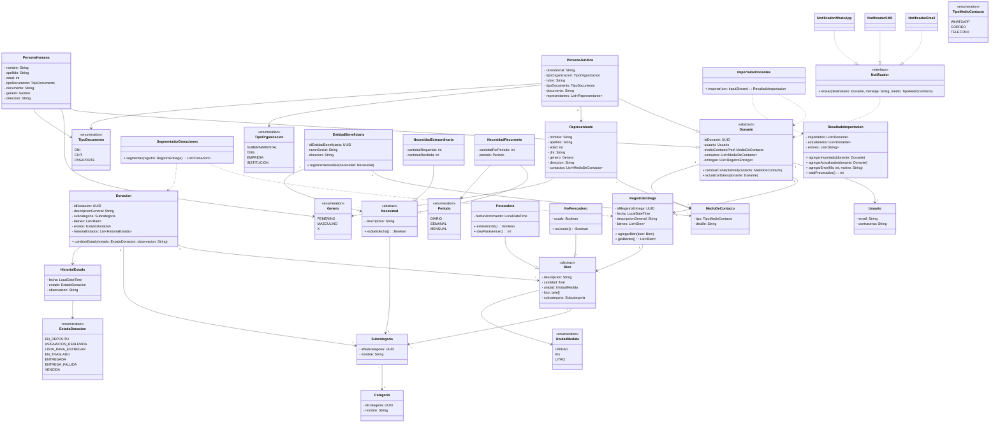

# DonaTrack

## Diagrama de clases

```mermaid
classDiagram

    class Donante {
        <<abstract>>
        - idDonante: UUID
        - usuario: Usuario
        - medioContactoPred: MedioDeContacto
        - contactos: List~MedioDeContacto~
        - entregas: List~RegistroEntrega~
        + cambiarContactoPred(contacto: MedioDeContacto)
        + actualizarDatos(donante: Donante)
    }

    class Usuario {
        - email: String
        - contrasenia: String
    }

    class PersonaHumana {
        - nombre: String
        - apellido: String
        - edad: int
        - tipoDocumento: TipoDocumento
        - documento: String
        - genero: Genero
        - direccion: String
    }

    class PersonaJuridica {
        - razonSocial: String
        - tipoOrganizacion: TipoOrganizacion
        - rubro: String
        - tipoDocumento: TipoDocumento
        - documento: String
        - representantes: List~Representante~
    }

    class Representante {
        - nombre: String
        - apellido: String
        - edad: int
        - dni: String
        - genero: Genero
        - direccion: String
        - contactos: List~MedioDeContacto~
    }

    class MedioDeContacto {
        - tipo: TipoMedioContacto
        - detalle: String
    }

    class RegistroEntrega {
        - idRegistroEntrega: UUID
        - fecha: LocalDateTime
        - descripcionGeneral: String
        - bienes: List~Bien~
        + agregarBien(bien: Bien)
        + getBienes(): List~Bien~
    }

    class Donacion {
        - idDonacion: UUID
        - descripcionGeneral: String
        - subcategoria: Subcategoria
        - bienes: List~Bien~
        - estado: EstadoDonacion
        - historialEstados: List~HistorialEstado~
        + cambiarEstado(estado: EstadoDonacion, observacion: String)
    }

    class Bien {
        <<abstract>>
        - descripcion: String
        - cantidad: float
        - unidad: UnidadMedida
        - foto: byte[]
        - subcategoria: Subcategoria
    }

    class Perecedero {
        - fechaVencimiento: LocalDateTime
        + estaVencido(): Boolean
        + diasParaVencer(): int
    }

    class NoPerecedero {
        - usado: Boolean
        + esUsado(): Boolean
    }

    class HistorialEstado {
        - fecha: LocalDateTime
        - estado: EstadoDonacion
        - observacion: String
    }

    class Categoria {
        - idCategoria: UUID
        - nombre: String
    }

    class Subcategoria {
        - idSubcategoria: UUID
        - nombre: String
    }

    class SegmentadorDonaciones {
        + segmentar(registro: RegistroEntrega): List~Donacion~
    }

    class ImportadorDonantes {
        + importar(csv: InputStream): ResultadoImportacion
    }

    class ResultadoImportacion {
        - importados: List~Donante~
        - actualizados: List~Donante~
        - errores: List~String~
        + agregarImportado(donante: Donante)
        + agregarActualizado(donante: Donante)
        + agregarError(fila: int, motivo: String)
        + totalProcesados(): int
    }

    class EntidadBeneficiaria {
        - idEntidadBeneficiaria: UUID
        - razonSocial: String
        - direccion: String
        + registrarNecesidad(necesidad: Necesidad)
    }

    class Necesidad {
        <<abstract>>
        - descripcion: String
        + esSatisfecha(): Boolean
    }

    class NecesidadExtraordinaria {
        - cantidadRequerida: int
        - cantidadRecibida: int
    }

    class NecesidadRecurrente {
        - cantidadPorPeriodo: int
        - periodo: Periodo
    }

    class Notificador {
        <<interface>>
        + enviar(destinatario: Donante, mensaje: String, medio: TipoMedioContacto)
    }

    class NotificadorEmail
    class NotificadorSMS
    class NotificadorWhatsApp

    class Genero {
        <<enumeration>>
        FEMENINO
        MASCULINO
        X
    }

    class TipoOrganizacion {
        <<enumeration>>
        GUBERNAMENTAL
        ONG
        EMPRESA
        INSTITUCION
    }

    class TipoMedioContacto {
        <<enumeration>>
        WHATSAPP
        CORREO
        TELEFONO
    }

    class TipoDocumento {
        <<enumeration>>
        DNI
        CUIT
        PASAPORTE
    }

    class EstadoDonacion {
        <<enumeration>>
        EN_DEPOSITO
        ASIGNACION_REALIZADA
        LISTA_PARA_ENTREGAR
        EN_TRASLADO
        ENTREGADA
        ENTREGA_FALLIDA
        VENCIDA
    }

    class UnidadMedida {
        <<enumeration>>
        UNIDAD
        KG
        LITRO
    }

    class Periodo {
        <<enumeration>>
        DIARIO
        SEMANAL
        MENSUAL
    }

    PersonaHumana --|> Donante
    PersonaJuridica --|> Donante
    Perecedero --|> Bien
    NoPerecedero --|> Bien
    NecesidadExtraordinaria --|> Necesidad
    NecesidadRecurrente --|> Necesidad
    NotificadorEmail ..|> Notificador
    NotificadorSMS ..|> Notificador
    NotificadorWhatsApp ..|> Notificador

    Donante "1" --> "1" Usuario
    Donante "1" --> "*" RegistroEntrega
    Donante "1" --> "*" MedioDeContacto
    PersonaJuridica "1" --> "*" Representante
    Representante "*" --> "*" MedioDeContacto
    Representante --> Genero
    PersonaHumana --> Genero
    PersonaJuridica --> TipoOrganizacion
    PersonaHumana --> TipoDocumento
    PersonaJuridica --> TipoDocumento

    RegistroEntrega "1" --> "*" Bien
    Donacion "1" --> "*" Bien
    Donacion "1" --> "1" Subcategoria
    Donacion "1" --> "*" HistorialEstado
    HistorialEstado --> EstadoDonacion

    Bien "*" --> "1" Subcategoria
    Bien --> UnidadMedida
    Subcategoria "*" --> "1" Categoria

    SegmentadorDonaciones ..> RegistroEntrega
    SegmentadorDonaciones ..> Donacion
    ImportadorDonantes ..> Donante
    ImportadorDonantes ..> ResultadoImportacion

    EntidadBeneficiaria "1" --> "*" MedioDeContacto
    EntidadBeneficiaria "1" --> "*" Necesidad
    Necesidad "*" --> "1" Subcategoria
    NecesidadRecurrente --> Periodo

    Notificador ..> Donante
```