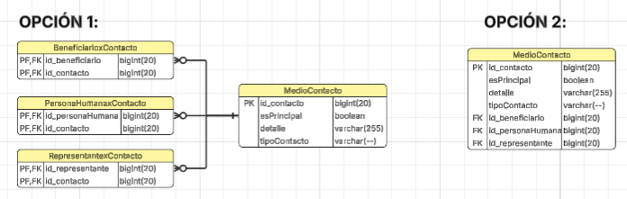

# Justificaciones sobre el DER de _DONACIONES_

## Decisión sobre mapeo de relaciones a medioContacto

Para el mapeo de relaciones a MedioContacto (ahora `Contactos`) estábamos entre la **Opción 1** (Tablas intermedias) y la **Opción 2** (Arco Exclusivo con FKs nulas), que se muestran en la imagen.

Analizamos la Opción 1 y nos dimos cuenta de que no necesitamos la flexibilidad de "Muchos a Muchos". En nuestro dominio, un Contacto le pertenece exclusivamente a una entidad, ya que atributos como `esPrincipal` pierden sentido si el contacto se comparte. Si dos personas comparten el mismo teléfono, preferimos que sean dos registros de `MedioContacto` lógicamente distintos.

Por lo tanto, **nos inclinamos fuertemente por la Opción 2**. Entendemos que nos genera un _Arco Exclusivo_ (donde 2 de las 3 FKs siempre serán `NULL`), pero creemos que es un trade-off aceptable para evitar el costo de performance que nos generarían 3 tablas intermedias. 

Además, descartamos la idea de usar una asociación polimórfica genérica (un solo `dueño_id`) para no perder la integridad referencial de las FK en la base de datos. Mientras que, componentes puros de software como `ClienteWhatsapp` o `ClienteCorreo`, se marcaron con `@Transient` ya que no nos interesa persistir los clientes usados; esto corresponde a lógica de negocio.

---

Mapeamos Bien con SINGLE_TABLE: una sola tabla bienes con el discriminador tipo_bien.

- Las subclases casi no se diferencian en datos: cada una agrega un solo atributo (fecha_vencimiento o esta_usado), y el resto está en Bien. Con JOINED tendríamos tablas de una columna y un join en cada consulta, sin ninguna ventaja.
- Costo que asumimos: esas dos columnas quedan nullables en la base. Lo cubre el dominio: cada constructor lanza DominioException si falta su atributo obligatorio.

---
Para el mapeo de la clase donante se decio usar Joined table porque sus clases hijas poseen más atributos propios de los que comparten con el padre.
Por ejemplo donante Humana tiene: nombre, apellido, fecha_nacimiento, género, direccion.
y el donante Juridica tiene: razon_social, tipo_organizacion, rubro.
Si usara SINGLE_TABLE, crearía una tabla con muchos valores NULL (más del 50% de las columnas estarían vacías para cualquier fila dada). 
JOINED mantiene un esquema limpio y normalizado.

Se decidio embeber la clase Documento, ya que cada documento es propio de una instancia, es decir es una relacion @OnetoOne donde un donante humano tiene un documento y un documento pertenece solo a un donante o a un solo representante.

